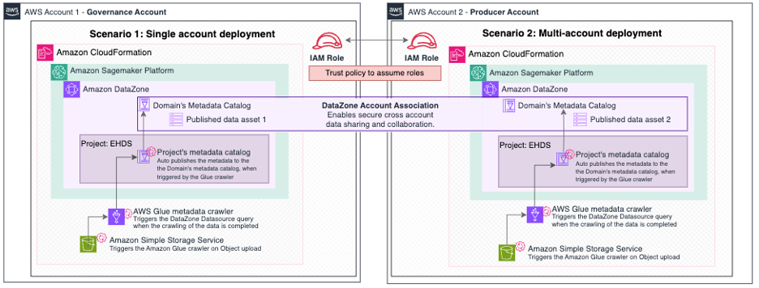
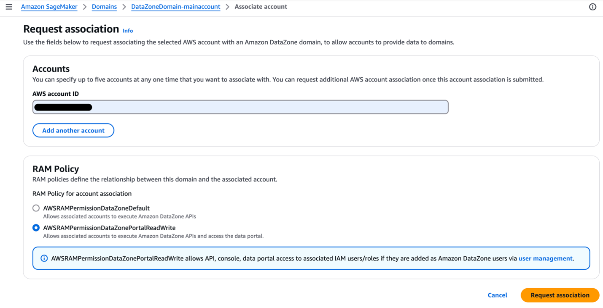
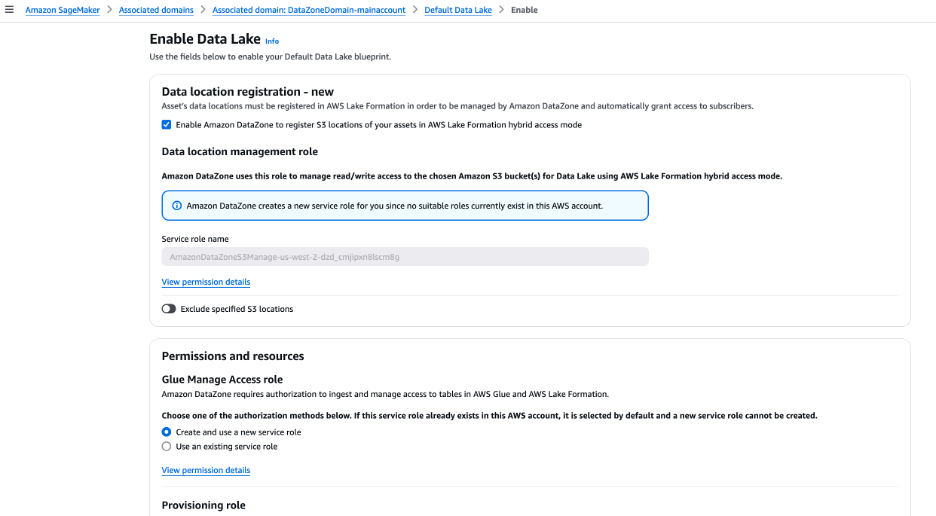
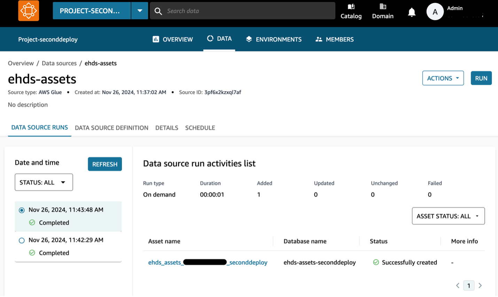
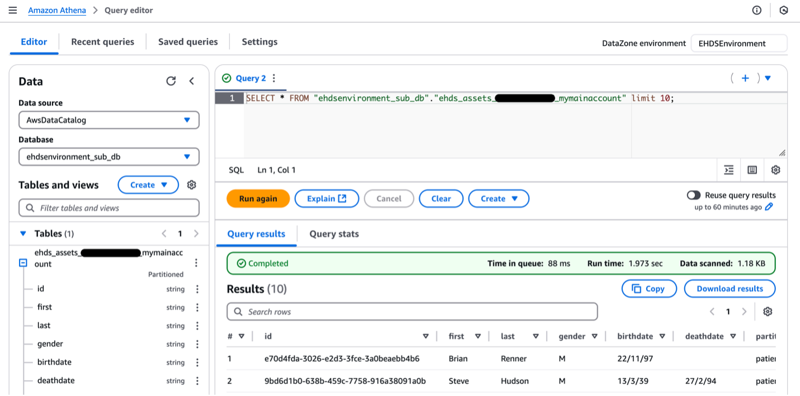

## Using AWS for EHDS: a technical guide to building a data platform for secure health data use

## Project overview
This repository contains the code and CloudFormation template to deploy the solution described in the <BLOG_LINK> blog post. The post  walks you through the technical implementation details for building such data platforms using AWS services. Whether you are a healthcare organization, technology provider, or systems integrator, this post aims to equip you with the technical knowledge to build a secure data platform for secondary usage of health data in alignment with the [EHDS regulation](https://www.consilium.europa.eu/en/press/press-releases/2025/01/21/european-health-data-space-council-adopts-new-regulation-improving-cross-border-access-to-eu-health-data/). At the core of this implementation is Amazon DataZone, an out-of-the-box data management service that offers a broad set of fine-grained access controls and data governance configurations. This ensures secure data sharing and collaboration across teams and departments. 

## Solution Architecture
In this blog post, we provide two scenarios of how to implement this architecture: 



### Single account deployment (Scenario 1)
This represents the primary governance account setup where an Amazon DataZone domain serves as the foundation for centralized data management. This scenario is better for development and testing of the Amazon DataZone capabilities. It creates a comprehensive data management infrastructure. 

### Multi-account deployment (Scenario 2)
This represents an extension of the main setup into a secondary AWS account. It maintains similar infrastructure components but operates in a separate account. This enables cross-account data sharing and allows for distributed data management while maintaining centralized discovery and access control.

We will refer to the primary account configured in the single account deployment option as the governance account and the second account configured in the multi-account deployment as the producer account.

> **_NOTE:_** The following architecture and technical implementation serve for demonstration purposes.
 
The solution enhances the Amazon DataZone domain's centralized data governance with automated workflows for data transformation and publishing. When data is uploaded to an S3 bucket, it triggers an automation flow that crawls the data with an AWS Glue Crawler, adds it to the AWS Glue Data Catalog, and automatically triggers a Data Source run. This allows for the data to be made available for publishing as soon as it is added to an S3 bucket. 


## Solution deployment

We have prepared two CloudFormation templates that provision and configure the necessary AWS services. These templates provide two deployment options, one for each scenario.
The instructions are separated in two implementations, depending on your preference and availability of deployment to multiple accounts.

### Prerequisites

The following prerequisites are necessary to deploy this solution:

- Access to at least one AWS account
- Administrative IAM permissions for [Amazon IAM](https://aws.amazon.com/iam/), [Amazon DataZone](https://aws.amazon.com/datazone/), [Amazon LakeFormation](https://aws.amazon.com/lake-formation/), [Amazon S3](https://aws.amazon.com/s3/), [AWS Lambda](https://aws.amazon.com/lambda/), [AWS Glue](https://aws.amazon.com/glue/).

Note: While the second deployment option uses two AWS accounts, neither deployment option requires an AWS Organizations setup. By default, all data at rest is encrypted using AWS-managed keys through AWS Key Management Service (KMS). You have the flexibility to use customer-managed keys if you prefer more control over your encryption settings.

### Single account deployment
This section will walk you through the steps to configure the governance account. 

1.	Clone the repository on GitHub using git. You can also manually download the CloudFormation templates from GitHub.
```
git clone https://github.com/aws-samples/a-technical-guide-to-building-a-data-platform-for-secure-health-data-use.git
```
2.	In the governance account, go to the CloudFormation console within your chosen Region. Under the Stacks section, choose the Create Stack dropdown and choose With new resources (standard).
3.	Leave the prerequisites section with the default settings. Under the Specify template section, choose Upload a template file. Upload the *mainaccount.yml* file.
4.	Give a Stack name of your preference.
5.	Choose Next. Leave everything default and choose the I acknowledge that AWS CloudFormation might create IAM resources checkbox.
6.	Choose Next. Review the settings and choose Submit. 

After a few minutes, the deployment is complete and you should see an Amazon DataZone domain created. You can also get the data portal’s URL in the outputs of the CloudFormation template. 

The single account deployment is now complete. You can test the solution by moving to the section: Upload and publish data. 

If you would like to deploy a multi-account environment, follow this next section for setting up and configuring the multi-account deployment.

### Multi-account deployment
This section will walk you through the steps to configure the producer account. You need to have completed the single account deployment steps to follow these instructions.

1.	In the governance account, navigate to the Amazon SageMaker platform. On the dashboard, choose View existing domains for Amazon DataZone and choose the domain with the prefix: *DataZoneDomain-<stack-name>*
2.	On the domain page, scroll down and on the first tab named “Account associations” choose Request association, as shown in the following figure.


3.	A new page named Associate account opens. Enter the AWS Account ID of the data producer account that you want to associate.
4.	Under RAM Policy, make sure to choose *AWSRAMPermissionDataZonePortalReadWrite*. Choose Request Association, as shown in the following figure.



You have now requested to associate the producer account to the domain. This allows members of the associated account to access the domain’s data portal and start publishing data. 

5.	Still in the governance account within the Amazon DataZone domain page, go to the tab User management, as shown in the following figure. 
6.	Choose IAM Users from the dropdown. Copy the ARN of the role that contains *DataZoneDomainExecutionRole*. You need it for a further step, so paste it in a text editor for now.


Next, you create necessary resources and permissions to run the CloudFormation stack in the producer account.

7.	Log in to your producer account, ensuring you are in the AWS Region where you deployed the Amazon DataZone domain in the governance account. 
8.	On the Amazon SageMaker Platform console, choose View requests. You will see the association request from the governance account. Choose the request and select Review Request.
9.	A new page opens named Accept & configure AWS association. Choose Accept new permissions.
10.	Once the association has been created, click the associated domain. Copy the IAM role under the Data portal URL in your text editor, as showed here. 


11.	Scroll down to the Default Blueprints section. Select the Default Data Lake option and click “Enable”. On the next page enable the option for hybrid mode in the Data location registration section. Leave everything as default and click “Enable Blueprint”.



Next you create an IAM role for a Lambda function allowing it to perform actions on the Amazon DataZone domain.

12.	Still in the producer account, visit the IAM console. Choose Role then Create role.
13.	Make sure AWS service is chosen. In the Service or use case dropdown, choose Lambda.
14.	Choose Next. Don’t add any permissions, and choose Next again. 
15.	Give a name to this role, such as *Lambda-role*. Choose Create role.
16.	After creation, search for your role and select it. It should not have any permissions for now. Choose Add permissions and Create inline policy.
17.	Choose the JSON editor view and paste in the following policy. Make sure to replace the ARN with the Amazon DataZone domain execution role that you copied in Step 6.

```
{
    "Version": "2012-10-17",
    "Statement": [
        {
            "Effect": "Allow",
            "Action": "sts:AssumeRole",
            "Resource": "<DataZone-domain-execution-role-arn>"
        }
    ]
}
```

17.	Give the Policy a name and choose Create policy. Lastly, copy the ARN of this newly created IAM role for your Lambda function and paste it into your text editor.

You must make sure the producer account can access the domain, as the portal’s URL is still greyed out. 

18.	Log back in to your Governance account and visit the Amazon DataZone console. Go to the Amazon DataZone domain under the User management tab, choose Add and Add IAM Users, as shown in the following figure.


19.	Next, choose the IAM Account option, Associated account, and paste the IAM Role ARN copied from the Amazon DataZone Data portal dashboard in Step 10. Choose Add then Add user(s).
20.	Visit the IAM console, choose Roles, and search for the prefix: *<StackName>-DataZoneDomainExecutionRole* that you copied in Step 6. 
21.	Choose the tab: Trust relationships and Edit trust policy.
22.	Under Principal, add the following: *"AWS": "<Lambda-role-arn>"*. This is the IAM Role ARN you copied in Step 17. Your trust policy should now look like the following:

```
{
    "Version": "2012-10-17",
    "Statement": [
        {
            "Effect": "Allow",
            "Principal": {
                "Service": [
                "datazone.amazonaws.com",
                "lakeformation.amazonaws.com",
                "lambda.amazonaws.com"
                ],
                "AWS": "<Lambda-role-arn>"
            },
            "Action": [
                "sts:AssumeRole",
                "sts:TagSession"
            ]
        }
    ]
}
```

23.	Choose Update policy

You are now ready to deploy the stack in the producer account! In the producer account, go to CloudFormation and follow the same steps as for the main account deployment. Make sure to deploy in the same Region as the domain. This time, upload the secondaccount.yml template. This template needs the following parameters:

- **AssumeRoleArn**: The ARN of the *DataZoneDomainExecution* role copied in Step 6.
- **DataZoneDomainId**: The ID of the Amazon DataZone domain. You can find it in the Amazon DataZone console. The ARN of the domain is structured as follows: *arn:aws:datazone:REGION:ACCOUNT_ID:domain/DOMAIN_ID*
- **HomeRegion**: The Region of the Amazon DataZone domain.
- **LambdaRoleArn**: The ARN of the Lambda role copied in Step 17. 

Wait for the stack to deploy and complete. The stack deployed the previously described automation components. You can now start testing the solution!

## Upload and publishing data

### Upload data to Amazon S3 

If you are following the single account setup, then complete the following steps within your governance account. For the multi-account setup, complete the following steps in the producer (second) account:

1.	In the Console search bar, enter "S3" to navigate to the Amazon S3 section of the Console.
2.	Choose the bucket with the suffix *ehds-assets*
3.	Choose Upload and choose Add folder. Choose the data inside the [medical_assets](./medical_assets) folder. Choose Upload.

### View data assets

After uploading the data, navigate back to the Amazon SageMaker platform and to the DataZone associated domains dashboard.
1.	In the Amazon DataZone domain, choose the link Data portal URL. This opens the Amazon DataZone domain’s Data portal.
2.	A project has been pre-created for you. Choose the dropdown next to Select Project and choose the Project with the prefix *EHDS-*.
3.	In the Project’s dashboard page, go to Data Sources. Choose the DataSource named *ehds-assets*.
4.	It has successfully queried the AWS Glue table that you uploaded to the *ehds-assets* S3 bucket. Choose the asset link listed Asset Name, as shown in the following figure. 



5.	On the asset’s summary page, you see details such as metadata, lineage, and data quality. It was pre-configured to auto-publish the data asset.

### Search for published data assets

In this section we view the catalog capability of Amazon DataZone that allows search to publish data assets and subscribe to them. 

1.	On the top bar of the Amazon DataZone Platform, choose the Catalogue icon, as shown in the following figure. 

 

2.	Within the Catalog view, choose the Amazon DataZone Domain from the left menu bar and view the data asset that has been published to the Domain’s meta data catalog. 

You can further filter by attributes such as data and asset type, owning project, source Region and account, and domain unit. 

### Subscribe and query data assets 

If you have followed the multi-account deployment, then you can filter by source account. Choose the account ID of the account from which you have uploaded and published the data assets. Then, you can query the data with Amazon Athena.

1.	Subscribe to the data asset by choosing the Subscribe button. 
2.	On the subscription page, enter a reason for subscribing, leave everything as default, and choose Request. The approval process was automated. Therefore, your subscription request is auto-approved. The default behavior needs the owner of the data asset to manually approve each request.
3.	Move back to the project overview page by choosing the project name on the top menu bar
4.	Within the project you have analytical tools listed on the right side of the overview page. Choose the option Query data (Amazon Athena), as shown in the following figure. 
5.	Choose Open Amazon Athena in the pop-up message.

 

### Query subscribed data assets with Athena 

Within the Athena Console, follow these steps to query the data to which you have subscribed:
1.	From the left option bar, choose the Database with the suffix *_sub_db*. This lists the data assets to which you have subscribed.
2.	Run SQL queries to view the data to which you have subscribed.

By following these steps you have successfully uploaded, published, and subscribed to data assets, and queried the subscribed data using Athena.

 


## Security

See [CONTRIBUTING](CONTRIBUTING.md#security-issue-notifications) for more information.

## License

This library is licensed under the MIT-0 License. See the LICENSE file.

